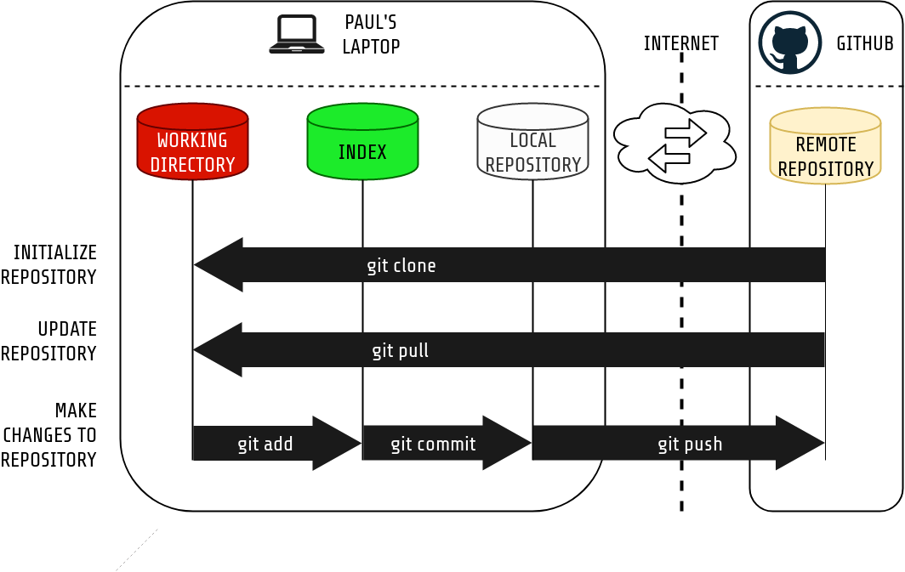

# Lesson 2: React Template Project

This is a template for a new React project. It includes all necessary bootstrap code to help you start writing your application logic immediately.

The purpose of this lesson is to learn the basics of a distributed version control, and deploy your first application to a hosted server. The exercises below will take you through the common operations using Git and Github, creating a Heroku server and deploying your application there. As a result you have also mastered writing a new React application using a template you could reuse and reproduce yourself. No magic involved.

## Task 1: Getting started

1. Install Git-bash for Windows from https://gitforwindows.org/
1. Create an account on Github
1. Add your SSH public key to Github to be able to make changes 
  - https://help.github.com/articles/generating-a-new-ssh-key-and-adding-it-to-the-ssh-agent/
  - https://help.github.com/articles/adding-a-new-ssh-key-to-your-github-account/
1. Set your user information in your Git configuration

## Task 2: Forking and cloning this repository 

1. Fork this repository
1. Clone the forked repository to your computer

## Task 3: Run the code on your computer

1. Enter the cloned directory
1. Run the code. If you need help, see [Running the code](#running-the-code).

## Task 4: Make changes, commit and push them to Github

1. Modify *src/index.jsx*
1. Check what files have been changed (`git status`)
1. Add the changed files to staging area (`git add <files_to_add>`)
1. Make a commit with a comment of the changes (`git commit -m "<commit_message>"`)
1. Save the changes to Github (`git push`)

## Task 5: Create a Vercel account and deploy the application

Steps:

1. Go to [Vercel](https://vercel.com) and create an account linked with you GitHub account. Give Vercel access to at least your fork of this lesson 2 repository.
1. To deploy your application, go to `Import Git Repository` and click `Import` next to lesson2-react-template.
1. Open the `Build and Output Settings` and check the `OVERRIDE` switch next to `Output Directory`. Write `dist` in the text input field.
1. Press deploy!

## Homework (easy): Learn git branching

1. Open https://learngitbranching.js.org/
1. From _Introduction sequence_ click the button 1
1. Continue the tutorial. You are finished once it starts talking about rebasing.

## Homework (hard): Connect your React-application to a Backend

The task is to write an application that collects a weather forecast from [Eficode weather forecast](https://weatherapp.eficode.fi/api/forecast).

The [`fetch`](https://developer.mozilla.org/en-US/docs/Web/API/Fetch_API/Using_Fetch) function will be useful for this purpose.

1. Examine this example about state and the `componentDidMount` method: https://codelikethis.com/lessons/react/fetching-data
1. Display information about the weather on the page, for example the temperature of the first element on the list.
1. Finally [release your application in Heroku](#running-this-lesson-in-heroku)

## Running the code

### What you will need

[nodejs](https://nodejs.org/en/download/package-manager/) or [docker](https://docs.docker.com/install/).

### Running with Node

* Install [nodejs](https://nodejs.org/en/download/package-manager/).
* Go to the project directory using a terminal / shell.
* Install dependencies `npm install`
* Run the app `npm start`
* Open browser in [http://localhost:8000](http://localhost:8000)
